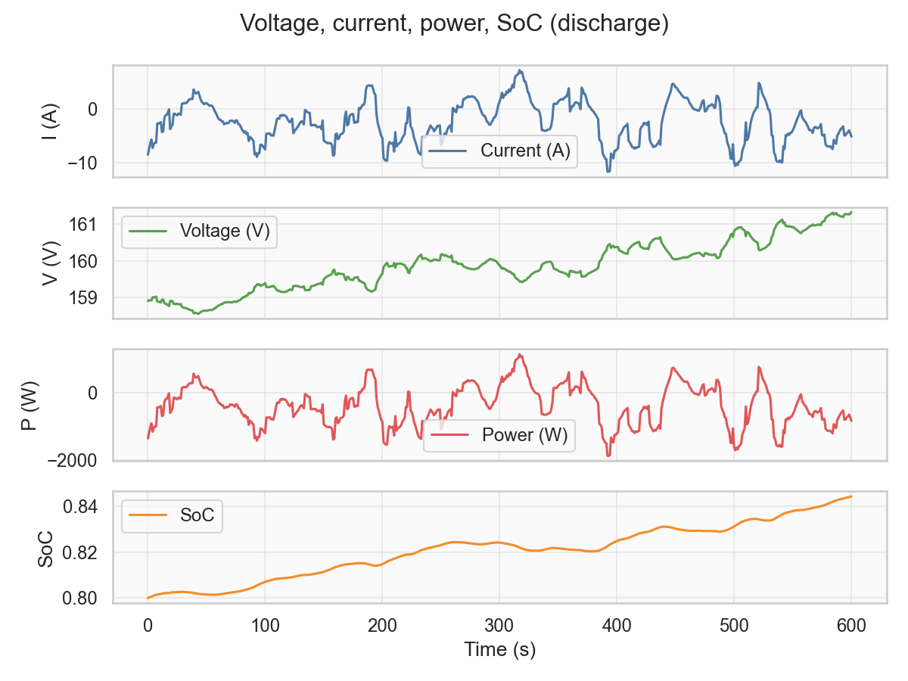
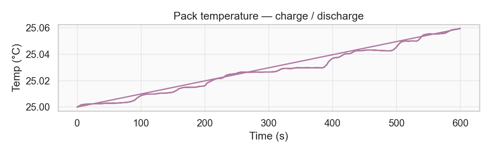
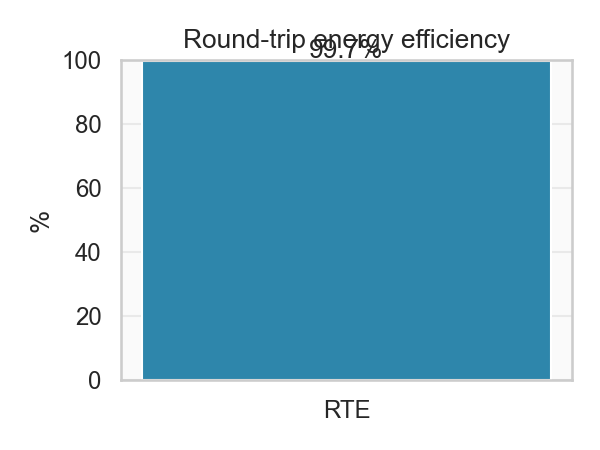
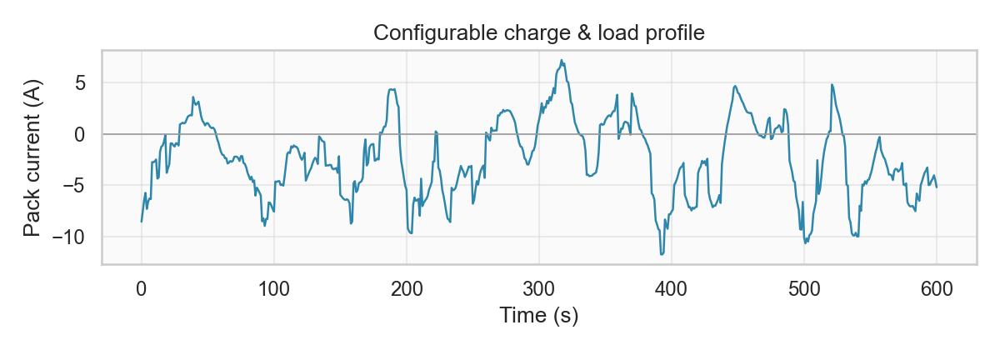
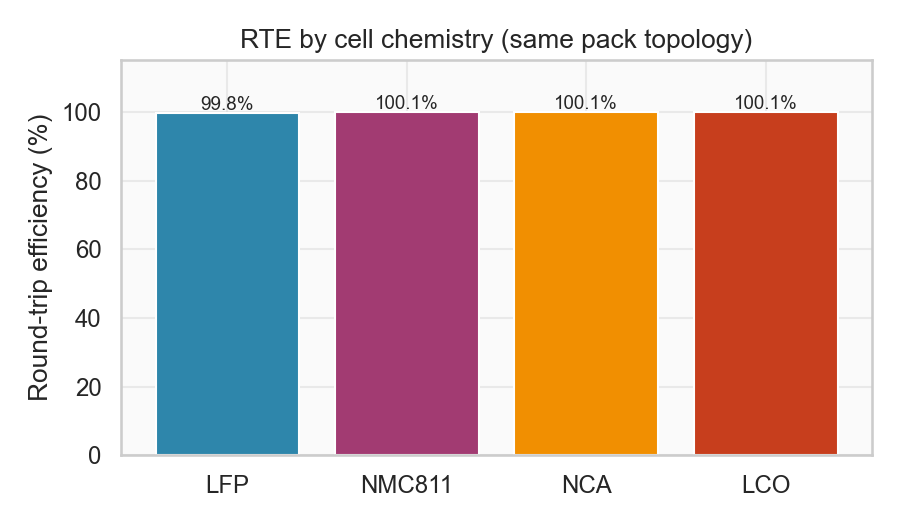
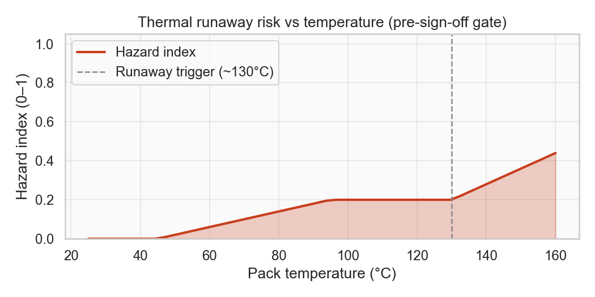
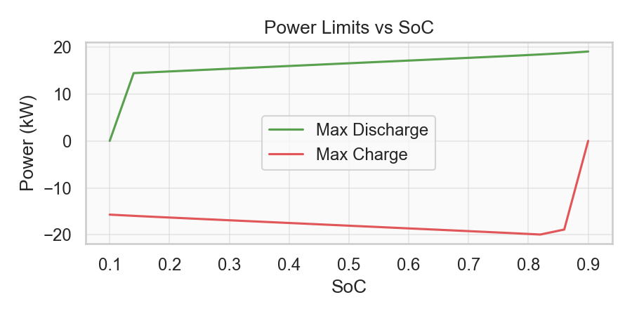

# BatteryPack

[](https://github.com/chaffybird56/BatteryPack/actions/workflows/ci.yml)
[](LICENSE)
[](https://www.python.org/)

**BatteryPack** is a Python framework that simulates how a lithium-ion battery pack behaves electrically and thermally under charge, discharge, and load—so you can estimate efficiency, temperature rise, power limits, and safety margins before hardware sign-off.

It couples a first-order equivalent-circuit cell model with pack-level series/parallel topology, lumped thermal dynamics, configurable cell chemistries (NMC, LFP, NCA, LCO), drive-cycle profiles, and Python-based failure-mode / thermal-runaway screening.

---

## Key capabilities

- **Electro-thermal modeling** — ECM cell (R0 + R1‖C1), Ns×Np pack, coupled thermal network and cooling parameters
- **DC power & efficiency** — Pack voltage, current, power, SoC time series; round-trip energy efficiency (RTE)
- **Configurable chemistries** — Preset ECM parameters for LFP, NMC811, NCA, LCO via `cell_params_for_chemistry()`
- **Load & charge profiles** — Synthetic and dataframe-based drive cycles; power limits vs SoC for BMS-style bounds
- **Safety analysis** — Thermal-runaway trigger checks, hazard index vs temperature, FMEA helper (`battery_pack/safety.py`)
- **Validation tooling** — EPA/WLTP/NEDC-style cycles, fast-charge protocol hooks, Monte Carlo sweeps, grid economics (see [FEATURES.md](FEATURES.md))
- **UPS / backup power** — Runtime and sizing helpers for backup scenarios (`battery_pack/ups_backup.py`)
- **Production-oriented** — Pytest suite, Black formatting, GitHub Actions CI on Python 3.10–3.12

---

## Quickstart

```bash
git clone https://github.com/chaffybird56/BatteryPack.git && cd BatteryPack
python3 -m venv .venv && source .venv/bin/activate
pip install -r requirements.txt

export PYTHONPATH=.
pytest tests/ -q
python scripts/generate_readme_plots.py   # refresh assets/*.png
```

```python
from battery_pack.config import cell_params_for_chemistry
from battery_pack.pack import BatteryPack

cell = cell_params_for_chemistry("LFP")  # or NMC811, NCA, LCO
pack = BatteryPack(cell_params=cell, ...)
```

---

## Screenshots

**Time series** — pack current, voltage, power, SoC during discharge:



**Thermal** — temperature through charge/discharge:



**Round-trip efficiency**:



**Charge / load profile**:



**Chemistry comparison** — RTE across cell presets (same pack topology):



**Safety** — thermal-runaway hazard vs pack temperature:



**Power limits** — max charge/discharge vs SoC:



---

## Project layout

```
battery_pack/
  cell.py, pack.py, thermal.py   # ECM + pack + thermal
  simulation.py                  # charge/discharge, RTE
  drive_cycles.py                # load / charge profiles
  safety.py                      # runaway, FMEA, hazard index
  config.py                      # chemistry presets
scripts/
  generate_readme_plots.py       # README figures
  run_demo.py                    # full demo → outputs/
tests/
```

More detail: [FEATURES.md](FEATURES.md) · [EXAMPLES.md](EXAMPLES.md) · [CHANGELOG.md](CHANGELOG.md)

## License

MIT — see [LICENSE](LICENSE).
